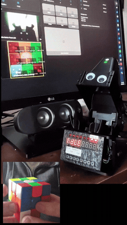

# Rubee - Scans and solves a rubiks cube.
A Home Assistant + ESPHome remake of [CUBOTino](https://www.instructables.com/CUBOTino-Autonomous-Small-3D-Printed-Rubiks-Cube-R/)

💬 [Discuss on the Home Assistant Community forum](https://community.home-assistant.io/t/rubee-scans-and-solves-a-rubiks-cube/1024172?u=mahko_mahko)

Main differences in this build:
- A HACS component and ESPHome talk to each other and split the work of cube scanning and solving.
- **ESP32-S3-CAM** instead of a Raspberry Pi Zero 2 W (or Zero W) + Pi Camera. Built in LED. ([board](https://github.com/nulllaborg/esp32s3-cam), [buy](https://www.aliexpress.com/item/1005012148685931.html))
- HACS component does colour detection and kociemba solving.
- ESPHome does camera control and implementing the solution.
- **Top-mounted camera with light-blocking hood** - consistent scans regardless of room lighting.
- **TM1638 display with 8 LEDs and buttons + buzzer built into the robot** — live status, audio feedback, and solve/stop/scramble/home controls.

User beware, most of the porting of this project and additional development and docs was vibe coded 💩.

---

## Dashboard

---

## Setup

 - Don't expect magic out of the box - like the original, servo and colour calibration take some patience to dial in.
  - Assembly generally follows the original - I haven't documented my own variations here. I've been pretty sparse with details of my build and the set-up (except for AI generated docs, some of which might be stale). But happy to develop detail if there's interest.

1. Install the software - HACS component + flash `rubiks-solver.yaml`.
2. Build the hardware - 3D-printed frame and servos per Andrea's "Top" version
3. Calibrate - servo positions/timings, then colour detection.

---

## Docs

- [Architecture / integration spec](docs/spec.md)
- [Robot hardware + ESPHome component](docs/robot.md)
- [Servo tuning reference](docs/servo-tuning.md)
- [Camera/cube orientation model](docs/orientation.md)
- [Collision prevention](docs/collision-prevention.md)
- [TM1638 display/buzzer/buttons](docs/tm1638.md)
- [Feature/entity inventory](docs/features.md)

---

## Extras

- Need a cube? [MoYu RS3M V5 3x3](https://www.aliexpress.com/item/1005006116653775.html)  - cheap, decent, magnetic. Learning on a magnetic cube is way better and should make it easier for the robit too.
- Want to learn to solve one by hand? [This playlist](https://www.youtube.com/playlist?list=PLUprj8UXelXGXLTvO5RaJ92_yJxOwd957) is fun if you've got a little patience.

---

## License / Credits

[MIT](LICENSE) for this project's software, except `custom_components/rubiks` which is [GPLv3+](custom_components/rubiks/LICENSE) — it depends on `twophase` for cube solving, since `kociemba` doesn't install reliably on Home Assistant OS. The physical CUBOTino design/mechanism is Andrea Favero's - see [his Instructables page](https://www.instructables.com/CUBOTino-Autonomous-Small-3D-Printed-Rubiks-Cube-R/) for terms on the design itself. Googly eyes as per  [Andreas Spiess's build](https://youtu.be/G5Ii6ENUXEs).